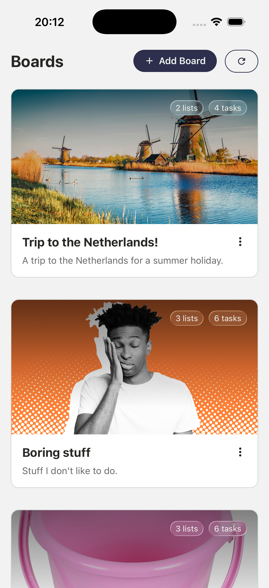
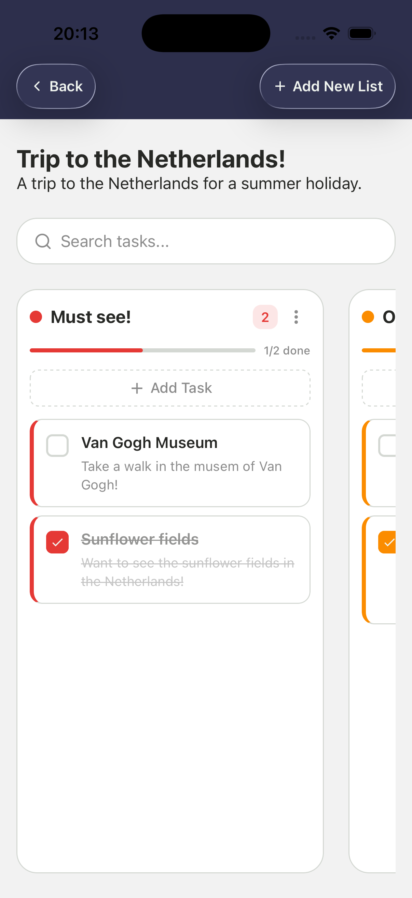
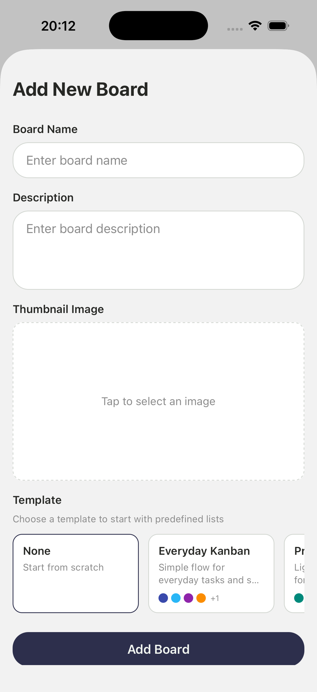
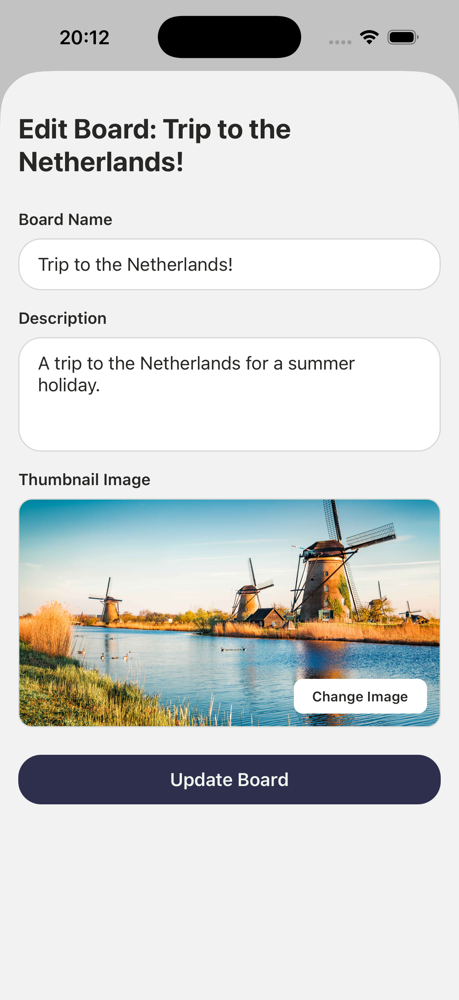
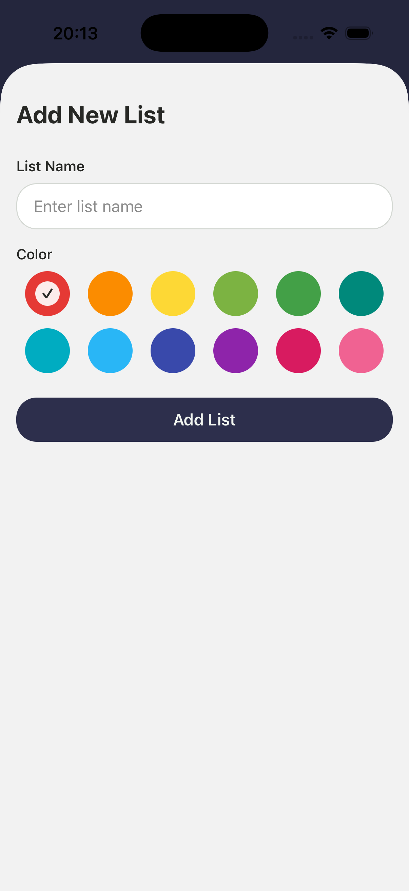
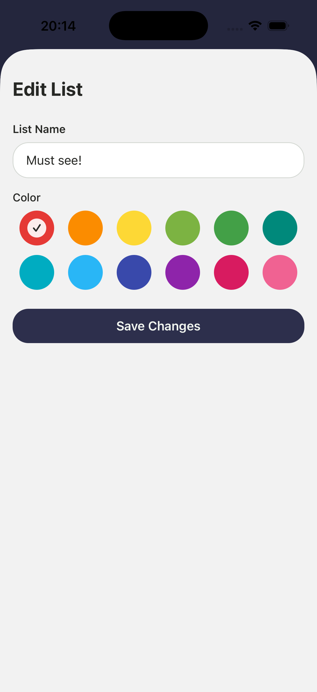
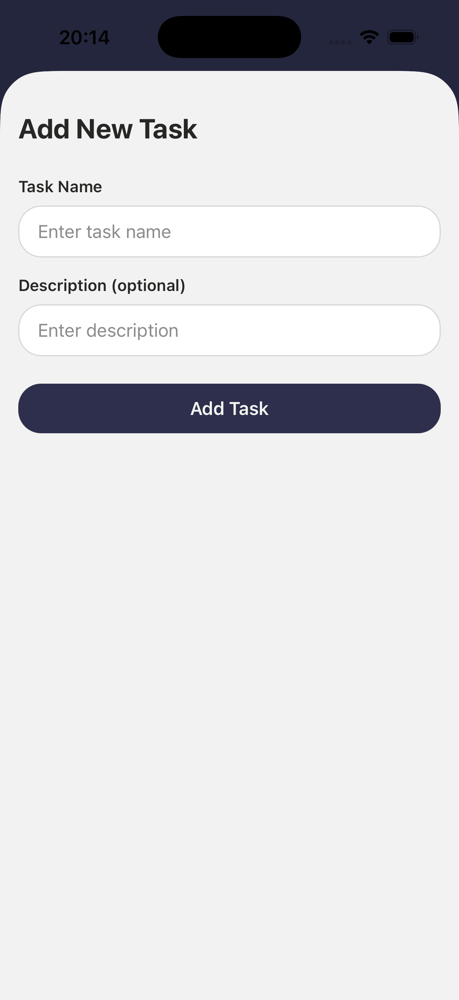
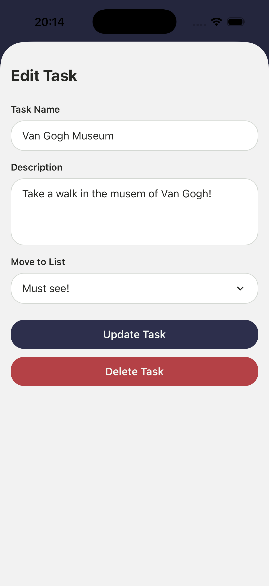

# Toodler

## Table of Contents

- [Description](#description)
- [Screenshots](#screenshots)
- [Setup Instructions](#setup-instructions)
- [Running the App](#running-the-app)
- [Features](#features)
- [Technologies Used](#technologies-used)
- [Platform Support](#platform-support)
- [Project Structure](#project-structure)
- [Known Issues](#known-issues)
- [Future Improvements](#future-improvements)
- [Authors](#authors)

## Description

Toodler is a Kanban-style task management application built with React Native and Expo. This mobile application enables users to organize their projects using boards, lists, and tasks following the Kanban methodology. Developed as part of the Umbrella agency's project management initiative, Toodler allows users to create multiple boards for different projects, organize tasks within customizable lists, and track progress by moving tasks between lists.

The application features full CRUD operations for boards, lists, and tasks, with additional enhancements including board templates for quick setup, persistent data storage, dark/light theme support, and a polished user interface with bottom sheet modals and form validation. Built with modern mobile development practices using Expo Router for file-based navigation, Zustand for state management, and TypeScript for type safety.

## Screenshots

|                                                  |                                                    |                                                |
| ------------------------------------------------ | -------------------------------------------------- | ---------------------------------------------- |
| **Boards list view**                             | **Board detail view with lists**                   | **Add board screen**                           |
|       |  |  |
| **Edit board screen**                            | **Add list screen**                                | **Edit list screen**                           |
|  |        |  |
| **Add task screen**                              | **Edit task screen**                               |                                                |
|      |      |                                                |

## Setup Instructions

### Prerequisites

- Node.js (v14 or higher, v18+ recommended)
- npm or yarn
- Expo CLI (optional but recommended): `npm install -g expo-cli`
- Xcode (for iOS development, macOS only)
- Android Studio (for Android development)

### Environment Setup

1. Install React Native dependencies
    - Ensure Node.js and npm are installed: `node --version` and `npm --version`
    - Install Expo CLI globally (optional): `npm install -g expo-cli`

2. Configure development environment

    **For iOS (macOS only):**
    - Install Xcode from Mac App Store
    - Install Command Line Tools: `xcode-select --install`
    - Accept Xcode license: `sudo xcodebuild -license accept`

    **For Android:**
    - Install Android Studio from [developer.android.com](https://developer.android.com/studio)
    - Open Android Studio and install Android SDK (API 33 or higher recommended)
    - Configure ANDROID_HOME environment variable

3. Set up emulators/simulators

    **iOS Simulator (macOS):**
    - Open Xcode > Preferences > Components
    - Download desired iOS simulator versions

    **Android Emulator:**
    - Open Android Studio > AVD Manager
    - Create a new virtual device (Pixel 5 recommended)
    - Select a system image (API 33 or higher)
    - Launch the emulator

4. Clone/download the project and install dependencies

    ```bash
    cd T-488-MAPP-A1
    npm install
    ```

5. Start the development server
    ```bash
    npm start
    ```

**Additional useful commands:**

- `npm run test` - Run linting, format checking, and type checking (combined validation)
- `npm run lint` - Run ESLint to check code quality
- `npm run lint:fix` - Automatically fix ESLint issues
- `npm run format` - Format code with Prettier
- `npm run format:check` - Check code formatting

## Running the App

### Navigate to project directory

`cd T-488-MAPP-A1`

### Install dependencies

`npm install`

### Running the App

`npm start`

This will start the Expo development server. You can then:

- Press `i` to run on iOS simulator
- Press `a` to run on Android emulator
- Scan the QR code with Expo Go app on your physical device

**Additional platform-specific commands:**

`npm run ios` - Run directly on iOS simulator

`npm run android` - Run directly on Android emulator

## Features

The application implements all required features based on assignment requirements:

### Boards (25%) - Fully Implemented

- View a list of all boards within the Board view
- Create a new board with name, description, and thumbnail photo (with image picker)
- Delete a board (via bottom sheet menu with confirmation)
- Edit existing boards (name, description, thumbnail)

### Lists (25%) - Fully Implemented

- View all lists associated with a specific board (horizontal Kanban layout)
- Create a new list with name, color selection (12 preset colors), and board reference
- Delete a list (via bottom sheet menu with confirmation)
- Edit existing lists (name, color)

### Tasks (30%) - Fully Implemented

- View all tasks associated with a specific list
- Create a new task with name, description, and completion status
- Move tasks from one list to another via drag-and-drop or edit task screen dropdown
- Mark tasks as complete/incomplete with visual feedback
- Edit existing tasks (name, description)
- Delete tasks

### Extras (20%) - Implemented

The following additional features have been implemented beyond the core requirements:

1. **Drag and Drop**: Custom-built drag-and-drop system for moving tasks between lists. Users can long-press a task card and drag it to any column on the board. The dragged card renders in an overlay layer above all other content, with visual feedback on both the placeholder and target drop zones. Built with React Native Gesture Handler and Reanimated for smooth 60fps interactions.

2. **Board Templates**: Users can choose from 5 predefined board templates when creating a new board (Everyday Kanban, Project Management, Study Planner, Trip Planner, Content Planning). Each template comes with pre-configured lists and colors for quick setup.

3. **Persistent Data Storage**: All data is stored persistently using AsyncStorage with Zustand middleware. Data survives app restarts, providing a true mobile app experience.

4. **Reset Store Functionality**: A reset button in the Boards screen header allows users to reset all data back to the initial sample state, useful for testing and demonstration.

5. **Dark/Light Theme Support**: Full theme support with automatic system color scheme detection. All UI components adapt to the user's preferred appearance setting.

6. **Edit Functionality**: Complete CRUD operations for all entities - boards, lists, and tasks can all be edited after creation, not just created and deleted.

7. **Haptic Feedback**: Tactile feedback on interactions including button presses, task completion, drag-and-drop, and destructive actions using expo-haptics.

8. **Task Search**: Real-time search functionality on the board detail view. Users can search for tasks by name or description across all lists within a board. The search input includes a clear button for quick reset and filters tasks instantly as you type, making it easy to find specific tasks in large boards.

## Technologies Used

- React Native (v0.81.5)
- Expo (~54.0.25)
- Expo Router (~6.0.15) - File-based routing and navigation
- React Navigation (v7.1.8)
- TypeScript (~5.9.2)
- Zustand (v5.0.8) - Lightweight state management with persistence middleware
- AsyncStorage (@react-native-async-storage/async-storage) - Persistent local storage
- @gorhom/bottom-sheet (v5.2.6) - Gesture-driven bottom sheet modals
- Expo Image Picker - Board thumbnail image selection
- Expo Haptics (~15.0.7) - Native haptic feedback
- Expo Linear Gradient - Visual gradient effects
- Expo Vector Icons (v15.0.3)
- React (v19.1.0)
- ESLint (v9.39.1) - Code quality and linting
- Prettier (v3.6.2) - Code formatting
- React Native Reanimated (v4.1.1) - Animations
- React Native Gesture Handler - Touch gesture support
- React Native Safe Area Context (v5.6.0) - Safe area handling

## Platform Support

### Primary Development Platform

- Primary Platform: iOS
- Test Device: iOS Simulator
- OS Version: Latest iOS version supported by Expo SDK 54

### Secondary Platform Testing

- Secondary Platform: Android
- Test Device: Android Emulator
- OS Version: Latest Android version supported by Expo SDK 54
- Testing Status: Early development phase - both platforms under active development
- Known Platform-Specific Issues: None at this time

#### As one great man once said:

> Cross-platform is just a way of saying 'let's launch iOS and fix Android later.' [@adnansahinovich](https://x.com/adnansahinovich/status/1964569598898192440)

### Platform-Specific Features

No platform-specific features at this time. The application uses React Native's cross-platform capabilities to provide a consistent experience across both iOS and Android.

## Project Structure

```
T-488-MAPP-A1/
├── app/                              # Expo Router navigation
│   ├── (app)/                        # Main app group
│   │   ├── boards/
│   │   │   └── [id].tsx              # Single board view (dynamic route)
│   │   ├── _layout.tsx               # App stack layout
│   │   └── index.tsx                 # Boards screen (home)
│   ├── modals/                       # Modal screens
│   │   ├── add-board.tsx
│   │   ├── add-list.tsx
│   │   ├── add-task.tsx
│   │   ├── edit-board.tsx
│   │   ├── edit-list.tsx
│   │   └── edit-task.tsx
│   ├── _layout.tsx                   # Root layout (providers, store hydration)
│   └── +not-found.tsx                # 404 error screen
├── assets/                           # Static assets
│   ├── fonts/
│   │   └── SpaceMono-Regular.ttf
│   └── images/
│       ├── adaptive-icon.png
│       ├── favicon.png
│       ├── icon.png
│       └── splash-icon.png
├── data/
│   └── data.ts                       # Pre-populated sample data
├── src/                              # Source code
│   ├── components/                   # Reusable React components
│   │   ├── bottom-sheet/             # Bottom sheet modals
│   │   │   ├── Backdrop.tsx
│   │   │   ├── BoardBottomSheetModal.tsx
│   │   │   ├── BottomSheetModal.tsx
│   │   │   ├── EditListBottomSheetModal.tsx
│   │   │   └── index.ts
│   │   ├── cards/                    # Card components
│   │   │   ├── BoardCard.tsx
│   │   │   ├── BoardColumn.tsx
│   │   │   ├── TaskCard.tsx
│   │   │   └── index.ts
│   │   ├── layout/                   # Layout components
│   │   │   ├── HeaderBackground.tsx
│   │   │   ├── SafeAreaScreen.tsx
│   │   │   ├── ScreenHeader.tsx
│   │   │   └── index.ts
│   │   ├── ui/                       # UI primitives
│   │   │   ├── Button/
│   │   │   ├── ColorPicker/
│   │   │   ├── GlassView/
│   │   │   ├── ModalCloseButton/
│   │   │   ├── TextInput/
│   │   │   ├── Themed.tsx
│   │   │   └── index.ts
│   │   └── index.ts
│   ├── constants/
│   │   ├── Colors.ts                 # Color definitions
│   │   └── DesignTokens.ts           # Spacing, border radius
│   ├── hooks/
│   │   ├── useColorScheme.ts
│   │   └── useTheme.ts
│   ├── lib/                          # Internal libraries
│   │   └── dnd/                      # Custom drag-and-drop system
│   │       ├── components/
│   │       │   ├── Draggable.tsx     # Gesture-enabled draggable wrapper
│   │       │   └── Droppable.tsx     # Drop zone with collision detection
│   │       ├── context/
│   │       │   └── DropContext.tsx   # Provider, overlay, and state management
│   │       ├── types.ts              # TypeScript interfaces
│   │       └── index.ts              # Public exports
│   ├── screens/                      # Screen components
│   │   ├── boards/
│   │   │   ├── AddBoardScreen.tsx
│   │   │   ├── BoardsScreen.tsx
│   │   │   ├── EditBoardScreen.tsx
│   │   │   ├── SingleBoardScreen.tsx
│   │   │   └── index.ts
│   │   ├── common/
│   │   │   ├── NotFoundScreen.tsx
│   │   │   └── index.ts
│   │   ├── lists/
│   │   │   ├── AddListScreen.tsx
│   │   │   ├── EditListScreen.tsx
│   │   │   └── index.ts
│   │   ├── tasks/
│   │   │   ├── AddTaskScreen.tsx
│   │   │   ├── EditTaskScreen.tsx
│   │   │   └── index.ts
│   │   └── index.ts
│   ├── store/
│   │   └── useStore.ts               # Zustand store with persistence
│   ├── templates/
│   │   ├── template.ts               # 5 predefined board templates
│   │   └── index.ts
│   ├── types/
│   │   └── data.ts                   # Board, List, Task interfaces
│   └── utils/
│       └── colors.ts                 # Color utilities
├── eslint.config.js                  # ESLint configuration (flat config)
├── .prettierrc.js                    # Prettier configuration
├── app.json                          # Expo configuration
├── package.json                      # Dependencies and scripts
└── tsconfig.json                     # TypeScript configuration
```

**Key Directory Explanations:**

- `/app` - Expo Router file-based routing with modal presentation and dynamic routes
- `/src/components` - Reusable UI components organized by category (bottom-sheet, cards, layout, ui)
- `/src/lib/dnd` - Custom drag-and-drop library with context, components, and types
- `/src/screens` - Screen components separated from routing, organized by feature (boards, lists, tasks)
- `/src/hooks` - Custom React hooks for theme and color scheme
- `/src/store` - Zustand store with AsyncStorage persistence
- `/src/templates` - Board template definitions for quick setup
- `/src/constants` - Design tokens and color definitions
- `/src/types` - TypeScript interfaces for type safety
- `/data` - Pre-populated sample data loaded on first app launch

**Data Models (defined in `src/types/data.ts`):**

**Board:**

- id: number
- name: string
- description: string (optional for user input but present in object)
- thumbnailPhoto: string

**List:**

- id: number
- name: string
- color: string (hex color code, optional for user to set but present in object)
- boardId: number (reference to parent board)

**Task:**

- id: number
- name: string
- description: string
- isFinished: boolean (completion status)
- listId: number (reference to parent list)

**State Management (Zustand Store - `src/store/useStore.ts`):**

The application uses Zustand for lightweight state management with AsyncStorage persistence:

- **Store State:** Contains boards, lists, and tasks arrays
- **Persistent Storage:** Data is automatically saved to AsyncStorage and restored on app startup
- **Hydration:** Store handles hydration state to ensure data is loaded before rendering
- **Reset Functionality:** `resetStore()` method resets all data back to initial state from `data/data.ts`
- **Full CRUD Actions:** addBoard, updateBoard, deleteBoard, addList, updateList, deleteList, addTask, updateTask, deleteTask, moveTask

**Usage Example:**

```typescript
import { useStore } from '@/src/store/useStore';

// Access state
const boards = useStore(state => state.boards);
const lists = useStore(state => state.lists);
const tasks = useStore(state => state.tasks);

// Reset data
const resetStore = useStore(state => state.resetStore);
```

## Drag and Drop Layer

To avoid package conflicts with third-party libraries, we built a custom drag-and-drop system inspired by [react-native-reanimated-dnd](https://github.com/luudoanh/react-native-reanimated-dnd). The implementation lives in `src/lib/dnd` and provides a complete solution for moving tasks between lists.

### Architecture

The system uses a portal-based overlay approach to ensure dragged items always render above all other content, regardless of their position in the component tree:

- **DropProvider**: Context wrapper that manages active drag state, droppable zone registration, collision detection, and renders a floating overlay layer for dragged content.
- **Draggable**: Gesture-enabled wrapper using `PanGestureHandler`. When a drag starts, it measures its position and renders a clone in the provider's overlay while showing a faded placeholder in the original location.
- **Droppable**: Drop zone wrapper that measures its layout, registers with the context, and provides visual feedback when a draggable enters/leaves. Supports configurable `collisionPadding` for easier drop targeting.

### Key Features

- **Overlay Rendering**: Dragged items render in an absolute-positioned overlay above all columns, solving z-index stacking issues across different list containers.
- **Collision Detection**: Real-time hit testing against registered droppable zones with configurable padding for forgiving drop targets.
- **Visual Feedback**: Placeholder opacity on drag start, active styling on drop zones when hovered.
- **Smooth Animations**: Built on React Native Reanimated for 60fps gesture tracking.

### Usage

```tsx
// Wrap your board content with DropProvider
<DropProvider>
  <ScrollView horizontal>
    {lists.map(list => (
      <BoardColumn key={list.id} list={list} tasks={tasks} />
    ))}
  </ScrollView>
</DropProvider>

// In BoardColumn, wrap the column with Droppable
<Droppable
  droppableId={`list-${list.id}`}
  onDrop={data => moveTask(Number(data.id), list.id)}
  activeStyle={{ backgroundColor: `${listColor}15` }}
>
  {/* Column content */}
</Droppable>

// In TaskCard, wrap with Draggable
<Draggable data={{ id: task.id }}>
  {/* Card content */}
</Draggable>
```

See `src/components/cards/TaskCard.tsx` and `src/components/cards/BoardColumn.tsx` for complete implementation examples.

## Known Issues

No known issues currently.

**Note on Data Persistence:**

- **Persistent Storage:** All data is stored persistently using AsyncStorage with Zustand middleware. Changes made during runtime (creating, updating, or deleting boards, lists, or tasks) are automatically saved and will persist across app restarts.
- **Initial Data:** On first launch, the app loads pre-populated sample data from `data/data.ts` to demonstrate functionality.
- **Reset Functionality:** The `resetStore()` function (accessible via the reset button in the Boards screen header) can be used to reset all data back to the initial sample state at any time.

## Future Improvements

### User Experience Enhancements

- Refine drag-and-drop interactions (e.g., reordering tasks within a list, cross-board moves)
- Add animations and smooth transitions between screens
- Add board-level search functionality and advanced task filters (by status, date, priority)
- Add task sorting options (by name, date, priority)

### Additional Features

- Task due dates and reminders with push notifications
- Task priority levels (high, medium, low)
- User authentication and multiple user profiles
- Board sharing and collaboration features
- Data export/import functionality (JSON format)
- Backend API integration for cloud synchronization
- Calendar integration
- Analytics and productivity insights

---

## Authors

- Milos Petrovic
- Nikulás Anthony Swain
- Sunna Einarsdóttir

---

**Project Assignment:** This project is developed as part of an academic assignment for the Umbrella agency project management initiative.
